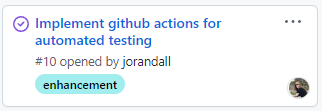
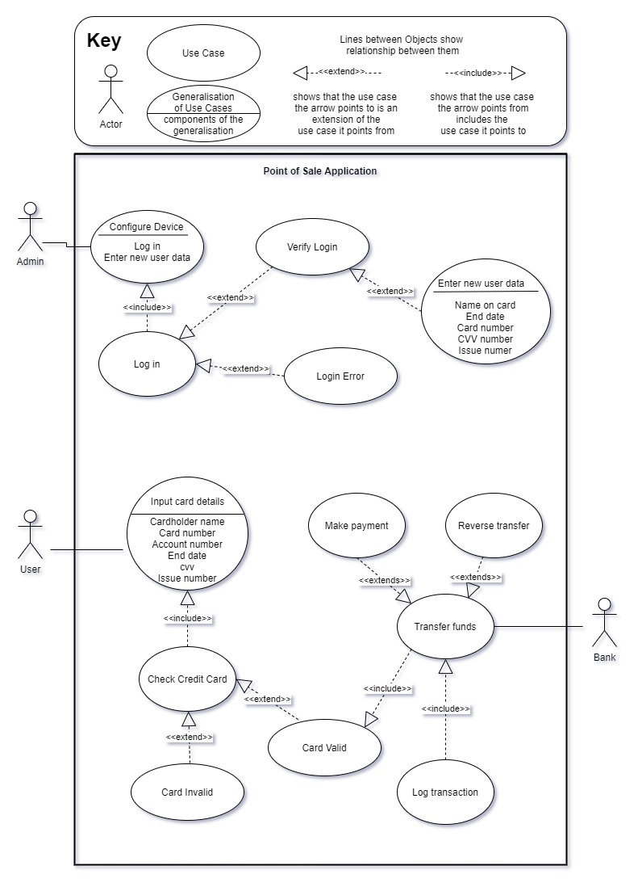
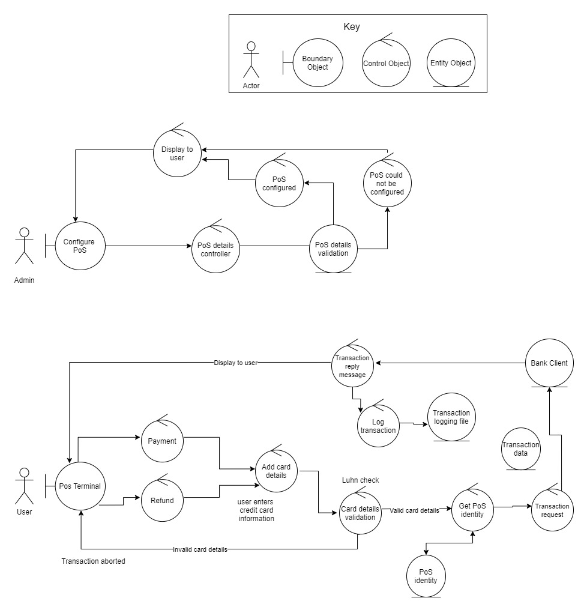

# Design Documentation

## Requirement Brief
For this project you are required to use inheritance to develop a simple web based, Java Object Orientated, Point of Sale application which allows the user to enter credit card details and a cash amount for a transaction. You should first present the user with a choice about what type of transaction they would like to make, either a payment or a refund option should be available. The user should then be asked to enter their credit card information at which point the account details for the account the user is making a transaction with will be retrieved. 

The application should communicate using a ReST interface to a mock banking service supplied. The service will confirm or deny the transaction. A transaction will be unsuccessful if the credit card number is entered incorrectly, in which case the user should be prompted to enter their card details correctly. 

Once a transaction has been completed the user account should be updated to show the new balance of their account.

The device should record all successful and unsuccessful transactions locally in a log file, cvv codes must not be recorded.

The Point of Sale should also allow an admin to log in and configure the Point of Sale identity data, which the transactions require to successfully transfer funds to or from the correct account. 

When your program runs it should have a simple menu system that allows you an administrator to configure the Point of Sale device. The menu should also have the option to use the Point of Sale device which will open the device interface for the user to input their information in order to make the transaction.

The full application requirements can be viewed [here](https://learn.solent.ac.uk/pluginfile.php/2938474/mod_resource/content/1/Assessment%20Brief%20-%20COM528-504%20-%20AE1%20-%20GROUP%20%282021-2022%29%201.0.pdf).

## Goals and Non-Goals

### **Goals**

- The UI will be a user-friendly web interface
- The identity of the device will be enterable by an administrator
- The device will record all successful and unsuccessful transactions
- Users will be able to enter their credit card details (name, credit card number, expiry date, cvv code)
- Users will be able to make a payment
- Users will be able to make a refund
- The application will interact with the bank service using a ReST service
- Money will be transferred between accounts correctly
- Data input validation will be implemented throughout
- Authentication will be implemented on the administrator account
- Authentication will be implemented on transaction request
- All error messages will be user-friendly and informative

### **Non-Goals**

- CVV codes will not be recorded
- The PoS device will not validate the CVV code

## Project Plan and Task Assignment

The team started planning this project by splitting it down into smaller, manageable tasks that only addressed one requirement at a time. These were recorded on GitHub Projects and divided up into three *To Do* categories - front-end, back-end, and documentation. These were originally recorded as notes within the project, and were updated to include the relevant name of the person doing the task when it was moved to *In Progress*. However, Github Issues were later used for all outstanding tasks.

>Screenshot of GitHub Project in progress

The team decided on a top-down approach to this project, as how data was handled in the front-end would directly affect how it needed to be handled in the back-end. 

The project was initially designed to be multi-module but, as the application only required simple functionality, this was refactored into a single WAR with layers as packages.

The team also decided to use MVC for the project structure, as this separated back-end functionality from the front-end, and would therefore make the code a lot more readable and easier to debug.

The team assigned the first tasks, such as setting up the project in NetBeans, creating the UIs, etc, but task assignment thereafter was managed dynamically, depending on what had already been implemented and who was currently available to work on the project, with regular meetings online and in-person to discuss. As each task was assigned, the ticket on Github Projects was updated accordingly.

All the following tasks are also available on [GitHub Projects](https://github.com/TomStrong/Com528-Assessment/projects/1):

| Owner        | Task     | Description    |
| :------------- | :----------: | :----------: | 
| Jake / Jo |  | Jake initially created a new project in NetBeans. This was then replaced by Jo to use a class excerise with all the client packages included. |
| Jo |  | All imported client packages needed to refactored into our group name. |
| Jo |  | A standalone bank client module became available so project was started again without multi-modules. |
| Tom |  | Design and implement a user-friendly UI that resembles a real PoS device, using JavaScript and CSS where appropriate. |
| Jo |  | Design and implement a basic administrator page that allows entry of the identity for the PoS device.  |
| Jo |  | Implement a basic index page which allows easy access to both admin and PoS pages. |
| Jo |  | Created default.properties file with valid data so the PoS would not need configuring every time it was tested. |
| Jo |  | Created the MVC Controller class. |
| Tom / Jo |  | Basic functionality implemented with GET requests to access all JSP pages. |
| Merlin |  | Created use case UML diagram. |
| Jo |  | Implemented functionality of the admin page, with data retrieved and updated in the .properties file. Also implemented functionality for transactions, reading in PoS identity data and input data to make a ReST call to the bank service. |
| Jo |  | Implemented workflow through GitHub actions so all code is tested as soon as pushed to repo. |
| Tom |  | Ensured all error messages are user-friendly and informative. |
| Tom |  | Updated formatting on PoS to be more user-friendly and readable. |
| Jo / Jake |  | Jo updated Log4J to include transaction logs. However, this would not work so Jake created a bespoke logging class with corresponding unit test. |
| Jo |  | Jo updated MVC Controller to perform the [Luhn Algorithm](https://en.wikipedia.org/wiki/Luhn_algorithm) on inputted credit card numbers within both Admin and PoS pages and ensured only credit card numbers that passed would be accepted. |
| Jo |  | Jo created use cases and included them within the design documentation. |
| Jo |  | Jo created test cases and included them within the design documentation. |

>>**_NOTE:_**  
An index page has been included for ease of the assessor for this assessment only. In a real-life situation, the user would only have access to the PoS device itself.

## Use Cases and Features

The following uses cases describe how users will use the application and outlines the system behaviour in response. 

| ID   | Actor    | Action     | System Behaviour |
| :------------- | :-------------  | :------------- | :-------------  | 
| UC1   | Admin  | Admin configures the PoS device.   | The identity of the device is updated locally. | 
| UC2   | Admin |  Admin configures the PoS device but misses a field.  |  An error message is displayed and the identity of the device is not updated.    | 
| UC3   | Admin  | Admin enters an incorrect credit card number   | The credit card number fails the Luhn check, an error message is displayed and the identity of the device is not updated. | 
| UC4   | User  |  User enters option that is neither payment or refund.  |  The device displays an error message and they are prompted to input again.   |
| UC5   | User  |  User enters option for a payment.   |  The device prompts the them to enter their credit card details.   | 
| UC6   | User  |  User enters option for a refund.   |  The device prompts them to enter their credit card details.   | 
| UC7   | User  |  User enters incorrectly formatted card data.   |  The device displays an error message, and prompts them to input again. | 
| UC8   | User  |  User enters incorrect card number.   |  The application check validity of the card number using the Luhn check, and displays an error message | 
| UC9   | User  |  User enters no card data.   | The device displays an error message and they are prompted to input again. | 
| UC10   | User  |  User confirms transaction.   | The device displays an "Approved" message and the transaction is completed.  The application transfers money between accounts and logs the transaction to the local log file (excluding cvv code). |
| UC11   | User  |  User does not have sufficient balance in account to complete transaction.   | The device displays a "Declined" message and the transaction is aborted. The application logs the transaction to the local log file (excluding cvv code and with the amount as *null*). |
| UC12   | User  |  User cancels a transaction before it is completed.  | The device returns to main menu. No monies are transfered and nothing is logged. |  

## Test Plan

| Test Case ID  | Use Case ID    | Preconditions     | Test Steps | Expected Post Conditions to Pass |
| :------------- | :-------------  | :------------- | :-------------  | :-------------  | 
| TC1 | UC1 | Tomcat server is running and Tester is on *Administrator* page. | 1. "http://com528bank.ukwest.cloudapp.azure.com:8080/rest" is entered into *Bank URL* field. 2. "testuser2" is entered into *Username* field. 3. "defaulttestpass" is entered into *Password* field. 4."test" is entered into *Name on Credit Card* field. 5."11/21" is entered into *Credit Card End Date* field. 6."4285860000000021" is entered into *Credit Card Number* field. 7."123" is entered into *CVV Number* field. 8. "01" is entered into *Issue Number* field.  9. *Submit Configuration* button is clicked. | Page displays "PoS now configured" message. Local application.properties file updated to match inputted data. | 
| TC2.1 | UC2 | Tomcat server is running and Tester is on *Administrator* page. | All steps as per TC1 except:  1. *Bank URL* field is left empty.| Page displays "Please complete all fields before updating properties" message. Local application.properties file has not updated.|
| TC2.2 | UC2 | Tomcat server is running and Tester is on *Administrator* page| All steps as per TC1 except:  2. *Username* field is left empty.| Page displays "Please complete all fields before updating properties" message. Local application.properties file has not updated.|
| TC2.3 | UC2 | Tomcat server is running and Tester is on *Administrator* page| All steps as per TC1 except: 3. *Password* field is left empty.| Page displays "Please complete all fields before updating properties" message. Local application.properties file has not updated. |  
| TC2.4 | UC2 | Tomcat server is running and Tester is on *Administrator* page.| All steps as per TC1 except: 4. *Name on Credit Card* field is left empty.| Page displays "Please complete all fields before updating properties" message. Local application.properties file has not updated.|
| TC2.5 | UC2 | Tomcat server is running and Tester is on *Administrator* page.| All steps as per TC1 except: 5. *Credit Card Number* field is left empty.| Page displays "Please complete all fields before updating properties" message. Local application.properties file has not updated.|
| TC2.6 | UC2 | Tomcat server is running and Tester is on *Administrator* page.| All steps as per TC1 except: 6. *CVV Number* field is left empty.| Page displays "Please complete all fields before updating properties" message. Local application.properties file has not updated.|   
| TC3 | UC3 | Tomcat server is running and Tester is on *Administrator* page.| All steps as per TC1 except: 5. "1234567891234567" is entered into *Credit Card Number* field.| Credit card number fails Luhn check within MVC Controller. Page displays "Invalid credit card number" message. Local application.properties file has not updated.|
| TC4 | UC4 | Tomcat server is running.  Tester is on "PoS" page and the PoS displays reads "Please select an option: 1) Payment  2) Refund" | 1. "8" is entered. 2. *Accept* button is clicked.| "Not a valid entry" is displayed at the top of the screen and the user is prompted to input again.| 
| TC5 | UC4 | Tomcat server is running.  Tester is on "PoS" page and the PoS displays reads "Please select an option: 1) Payment  2) Refund" | 1. "1" is entered. 2. *Accept* button is clicked.| The display of the PoS changes to "Please enter amount:"|
| TC6 | UC5 | Tomcat server is running.  Tester is on "PoS" page and the PoS displays reads "Please select an option: 1) Payment  2) Refund" | 1. "2" is entered. 2. *Accept* button is clicked.| The display of the PoS changes to "Please enter amount:"|
| TC7.1 | UC7 | Tomcat server is running.  Tester is on "PoS" page and has inputted: *Option* = "1"|1. "/" or "." is inputted for amount. 2. *Accept* button is clicked.| "Please enter a number" is displayed at the top of the screen. |
| TC7.2 | UC7 | Tomcat server is running.  Tester is on "PoS" page and has inputted: *Option* = "1"| 1. "10.00" is inputted for amount. 2. *Accept* button is clicked. 3. "bob" is inputted for name. 4. *Accept* button is clicked.  5. "1234" is inputted for credit card number. 6. *Accept* button is clicked.| "Card numbers must be 16 digits" is displayed at the top of the screen and the user is prompted to input again. |
| TC7.3 | UC7 | Tomcat server is running.  Tester is on "PoS" page and has inputted: *Option* = "1"| 1. "10.00" is inputted for amount. 2. *Accept* button is clicked. 3. "bob" is inputted for name. 4. *Accept* button is clicked. 5. "5133880000000012" is inputted for card number. 6. *Accept* button is clicked. 7. "1" is inputted for expiry date. 8. *Accept* button is clicked.| "Date must be formatted as MM/YY" is displayed at the top of the screen and the user is prompted to input again. |
| TC7.4 | UC7 | Tomcat server is running.  Tester is on "PoS" page and has inputted: *Option* = "1"| 1. "10.00" is inputted for amount. 2. *Accept* button is clicked. 3. "bob" is inputted for name. 4. *Accept* button is clicked. 5. "5133880000000012" is inputted for card number. 6. *Accept* button is clicked. 7. "11/21" is inputted for expiry date. 8. *Accept* button is clicked. 9. "1" is inputted for cvv. 10. *Accept* button is clicked.| "CVV should be 3 or 4 digits" is displayed at the top of the screen and the user is prompted to input again. |
| TC7.5 | UC7 | Tomcat server is running.  Tester is on "PoS" page and has inputted: *Option* = "1"|1. "10.00" is inputted for amount. 2. *Accept* button is clicked. 3. "bob" is inputted for name. 4. *Accept* button is clicked. 5. "5133880000000012" is inputted for card number. 6. *Accept* button is clicked. 7. "11/21" is inputted for expiry date. 8. *Accept* button is clicked. 9. "123" is inputted for cvv. 10. *Accept* button is clicked.  11. "1234" is inputted for issue number. 12. *Accept* button is clicked.| "Issue Number should be 0-2 digits" is displayed at the top of the screen and the user is prompted to input again. |
| TC8 | UC8 | Tomcat server is running.  Tester is on "PoS" page and has inputted: *Option* = "1" *Amount* = "10.00" *Name* = "Bob"| 1. "1234567891234567"  is inputted for card number. 2. *Accept* button is clicked. 3. "11/24" is inputted for expiry date. 5. *Accept* button is clicked. 6. "123" is inputted for CVV. 7. *Accept* button is clicked. 8. Issue number is left black. 9. *Accept* button is clicked.  10. *Accept* button is clicked to confirm the transaction.| "1234567891234567 is an invalid card number" is displayed at the top of the screen and the transaction is aborted. The log file is not updated. |
| TC9 | UC9 | Tomcat server is running.  Tester is on "PoS" page and has inputted: *Option* = "1"|1. Nothing is inputted for amount. 2. *Accept* button is clicked.| "Required" is displayed at the top of the screen. |
| TC10 | UC10 | Tomcat server is running.  Device identity card number is "4285860000000021". Tester is on "PoS" page and has inputted: *Option* = "1" | 1. "10.00" is inputted for amount 2. *Accept* button is clicked.  3. "bob" is inputted for name. 4. *Accept* button is clicked. 5. "5133880000000012" is inputted for card number. 6. *Accept* button is clicked. 7. "11/21" is inputted for expiry date. 8. *Accept* button is clicked. 9. "01" is inputted for issue number. 10. *Accept* button is clicked. 11. *Accept* button is clicked to complete transaction.| "Approved" is displayed at the top of the screen. £10.00 is transfered from card 5133880000000012 to card 4285860000000021, which can be seen [here](http://com528bank.ukwest.cloudapp.azure.com:8080/banktransactions). Transaction log records transaction excluding cvv code.|
| TC11 | UC11 | Tomcat server is running.  Device identity card number is "4285860000000021". Tester is on "PoS" page and has inputted: *Option* = "2" | 1. "500.00" is inputted for amount 2. *Accept* button is clicked.  3. "bob" is inputted for name. 4. *Accept* button is clicked. 5. "5133880000000012" is inputted for card number. 6. *Accept* button is clicked. 7. "11/21" is inputted for expiry date. 8. *Accept* button is clicked. 9. "01" is inputted for issue number. 10. *Accept* button is clicked. 11. *Accept* button is clicked to complete transaction.| "Declined. Insufficient balance in account 428586 000000002" is displayed at the top of the screen. No monies have been transferred. Transaction log records transaction with amount="null" and excluding cvv code.|
| TC12 | UC12 | Tomcat server is running.  Tester is on "PoS" page and has inputted: *Option* = "2" | 1. *Cancel* button is clicked. | The device returns to the front screen.|

## UML Diagrams

**Class UML Diagram**

**To do**

**Use Case UML Diagram**

The draw.io file can be found [here](UMLDiagrams/BankApplicationsUsecaseDiagram.drawio)

**Robustness Analysis Diagram**

The draw.io file can be found [here](BankApplicationsRobustnessDiagram.drawio)

**Robustness UML Diagram**

**To do**