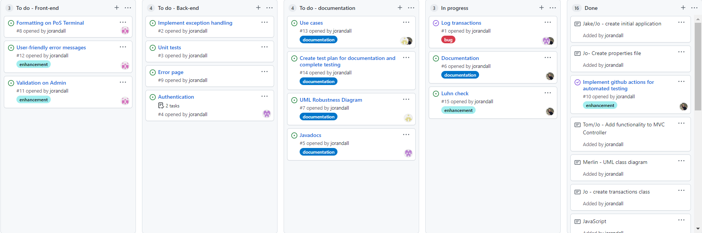

# Design Documentation

## Requirements
For this project, we were required to develop a simple web-based Point of Sale application that allowed a user to enter their credit card details to make a transaction. The application would then need to communicate with the mock banking service using the ReST service supplied to either confirm or deny the transaction.

In addition, the Point of Sale device needed to be configurable by an admin user as transactions would require the data associated with the PoS device to transfer funds to or from the correct user account.

## Goals and Non-Goals

### **Goals**

- The UI should be a user-friendly web interface
- The identity of the device should be enterable by an administrator
- The device should record all successful and unsuccessful transactions
- Users should be able to enter their credit card details (name, credit card number, expiry date, cvv code)
- Users should be able to make a payment
- Users should be able to make a refund
- The application should interact with the bank service using a ReST service
- Money should be transferred between accounts correctly
- Data input validation required throughout
- Authentication required on administrator account
- Authentication required on transaction request
- All error messages should be user-friendly and informative

### **Non-Goals**

- CVV codes should not be recorded
- The PoS device should not validate the CVV code

## Project Plan and Task Assignment

We statrted planning this project by splitting it down into smaller, manageable tasks that only addressed one requirement at a time. We then recorded these on [Github Projects](https://github.com/TomStrong/Com528-Assessment/projects/1) and divided the tasks up into three *To Do* categories - front-end, back-end, and documentation. 

We initially recorded these tasks as notes within the project, updating them to include the relevant name of the person doing the task when it was moved to *In Progress*. However, later we learned about creating Issues within Github so we converted all outstanding tasks to these.

>Screenshot of Github Project in progress

We decided on a top-down approach to this project, as how data was handled in the front-end would directly affect how it needed to be handled in the back-end. We also decided to use MVC for the project structure, as this separated back-end functionality from the front-end, and would therefore make the code a lot more readable and easier to debug.

Initial task assignment was as follows:

| Asignee   | Task    |
| :------------- | :-------------  |  
| Tom Strong   | Develop and implement PoS device UI  | 
| Jo Randall   | Develop and implement administrator UI | 
| Jo Randall   | Implement administrator functionality using DAO |
| Jo Randall   | Implement index page | 

>>**_NOTE_**  
We included an index page for ease of the assessor for this assessment only. In a real-life situation, the user would only have access to the PoS device itself.

Task assignment thereafter was managed dynamically, depending on what had already been implemented and who was currently available to work on the project, with regular meetings online and in-person to discuss.

## Use Cases and Features

The following uses cases describe how users will use the application and outlines the system behaviour in response. 

| Use Case ID   | Actor    | Action     | System Behaviour |
| :-------------: | :-------------:  | :-------------: | :-------------:  | 
| UC1   | Admin  |    |     | 
| UC2   | Admin |    |     | 
| UC3   | User  |    |     | 
| UC4   | User  |    |     | 

**To do**

## Test Plan

**To do**

## UML Diagrams

**Use Case UML Diagram**

**Robustness UML Diagram**

**To do**